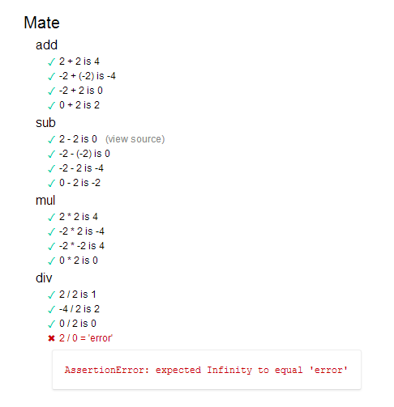

## UNIVERSIDADE FEDERAL DO RIO GRANDE DO SUL
#### INF01003 - Engenharia de Software II (Marcelo Pimenta).
---------------
- Guilherme Severo
- Eduarto Potter


### Mate


Mate é uma biblioteca de matemática muito poderosa. 
Suas funcionalidades são:

- Adição
- Multiplicação
- Subtração
- Divisão

### Modo de uso

Inclua o código

```html
<script src="mate.js"></script>
```

Depois disso você já pode usufruir da poderosa biblioteca

```javascript

var result = Mate.add(2,2); // result = 2

result = Mate.sub(2,2); // result = 0

result = Mate.mul(2,2); // result = 4

result = Mate.div(2,2); // result = 1

```
 

### Suite de testes

Usando o mocha você tem a suite de testes. Para conferir os testes acesse test.html.





```javascript
suite('Mate', function() {

    // ... 

    suite('add', function() {

        test('2 + 2 is 4', function() {
            assert.equal(Mate.add(2,2), 4);
        });

        test('-2 + (-2) is -4', function() {
            assert.equal(Mate.add(-2,-2), -4);
        });

         test('-2 + 2 is 0', function() {
            assert.equal(Mate.add(-2,2), 0);
        });

         test('0 + 2 is 2', function() {
            assert.equal(Mate.add(0,2), 2);
        });

    });

    // ...

    suite('div', function() {

        test('2 / 2 is 1', function() {
            assert.equal(Mate.div(2,2), 1);
        });

        test('-4 / 2 is 2', function() {
            assert.equal(Mate.div(-4,2), -2);
        });

         test('0 / 2 is 0', function() {
            assert.equal(Mate.div(0,2), 0);
        });

          test('2 / 0 =  \'error\'', function() {
            assert.equal(Mate.div(2,0), 'error');
        });

    });


});

```
